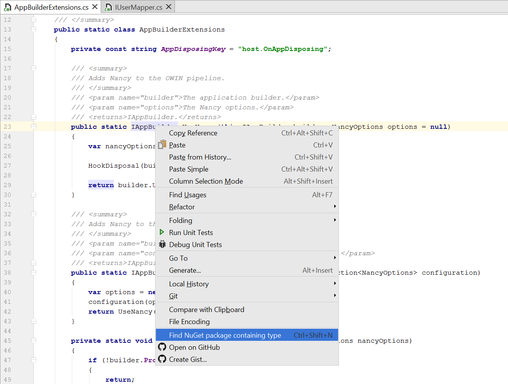

# Rider reverse package search (plugin)

**Note this project is not maintained - it is demoware and should be treated as such**

Rider example front-end plugin. Performs a reverse NuGet package search via [packagesearch.azurewebsites.net](http://packagesearch.azurewebsites.net).

This plugin can be installed manually into Rider. Download the `.jar` from the [latest release](https://github.com/maartenba/rider-plugin-reversepackagesearch/releases).

